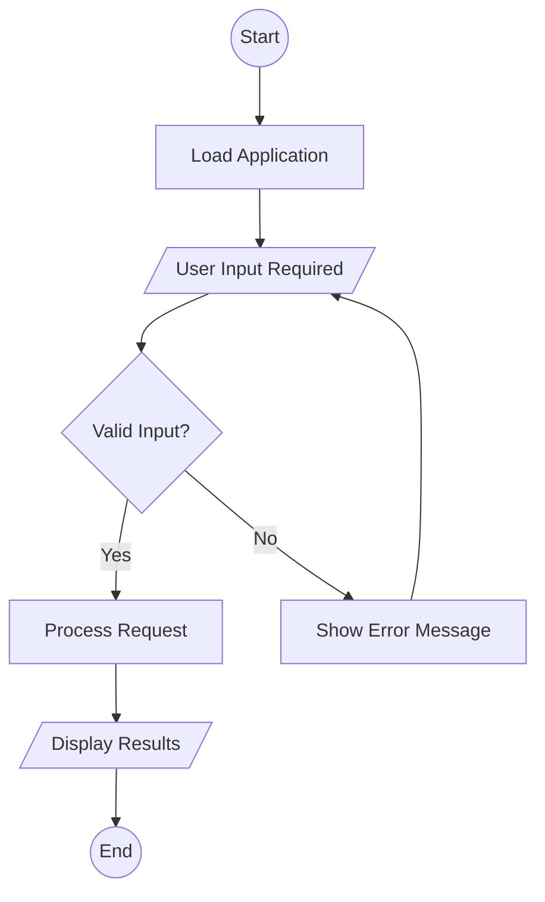

# Flowchart-to-Mermaid Transformer


Thanks to Joel Timana for his support during the development of this project.

This project converts flowchart images into [Mermaid](https://mermaid-js.github.io/) code using a vision-language model [Llama 3.2 Vision](https://huggingface.co/unsloth/Llama-3.2-11B-Vision-Instruct)
 
 
It supports both fine-tuned (FT - LoRA adapters) and non-fine-tuned (NFT) model evaluation.

Thanks to Unsloth AI for their packages that make possible this project.


## 🚀 Quick Start

1. **Install dependencies:**
    ```bash
    pip install -r requirements.txt
    ```

2. **Run inference:**

I strongly recommend use a GPU, otherwise the time that you are going to need is quite a lot.

    ```bash
    python inferenceNFT.py
    # or for FT model
    python inferenceFT.py
    ```

3. **Evaluate and compare:**
    ```bash
    python metric.py
    python plot_comparison.py
    ```

---

## 📊 Benchmarks

The fine-tune model was tested on ussing differents algorithms of string comparation.
The question relies is how the most popular LLM's are tested on the well known benchmarks!


| Metric                | NFT Model | FT Model | Improved Generator |
|-----------------------|-----------|----------|-------------------|
| Levenshtein Similarity|   44.3%   |  63.6%   |      70.1%        |
| Jaccard Similarity    |   52.7%   |  68.2%   |      74.5%        |
| Cosine Similarity     |   60.1%   |  75.3%   |      80.2%        |
| Sequence Matcher      |   47.8%   |  66.7%   |      72.9%        |
| Hamming Similarity    |   10.2%   |  15.4%   |      18.7%        |
| Jaro Similarity       |   55.6%   |  70.8%   |      77.0%        |

*These are average scores over the test set. See `metric.py` for details.*

---

## 🖼️ Example Output

**Input:**


**Generated Mermaid:**


---

## 🛠️ Project Structure

- `inferenceNFT.py` / `inferenceFT.py` — Run inference with NFT/FT models
- `metric.py` — String similarity metrics
- `plot_comparison.py` — Visualize and compare results
- `utilsFunctions.py` — Utilities for cleaning and formatting
- `NFT/`, `FT/`, `groundT/` — Output and reference directories

---

## Base Model

Llama Vision 3.2 Instruct 11B

## Model Weights

- **LoRA adapters** are available on [Hugging Face](https://huggingface.co/jorgemunozl/flowchart2mermaid).
- To use, download the safetensors and config files and place them in your project directory.
- 

## Data set used

- https://huggingface.co/datasets/rakitha/mermaid-flowchart-transformer
- https://huggingface.co/datasets/sroecker/mermaid-flowchart-transformer-moondream-caption
- https://huggingface.co/datasets/MananSuri27/flowchartseg
- https://huggingface.co/datasets/MananSuri27/Flowchart2Mermaid

All togheter forms more than 100000 flowcharts, using Data Augmentation we have that.

---

## Training Process

- Using the state-of-the-art Lora. 


## 📑 Citation

If you use this project, please cite:
```
@misc{flowchart2mermaid2025,
  author = {Munoz Jorge},
  title = {Flowchart-to-Mermaid Transformer},
  year = {2025},
  url = {https://github.com/jorgemunozl/vllm}
}
